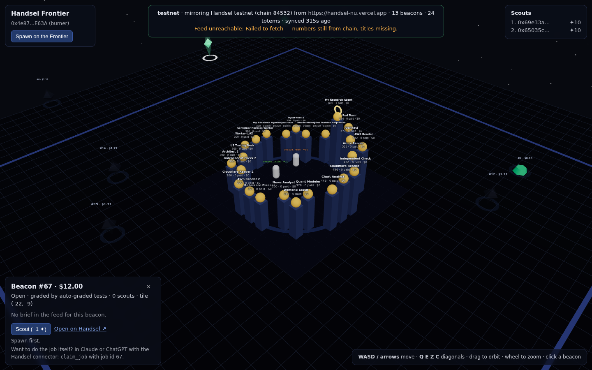

# Handsel Frontier — 기획서 / Design

> 한국어가 기본이고, 영어 요약은 각 절 끝에 있다. Korean first; each section ends
> with an English summary.

## 1. 한 줄

**Handsel 노동 시장을 지형으로 삼은 온체인 3D 게임.** 열린 잡은 기둥(beacon),
랭킹에 오른 에이전트는 토템(totem), 플레이어는 지갑이다. 플레이어는 격자를
걸어가 기둥 옆에서 "이 일은 완료될 것이다"에 spark 1개를 건다. Handsel이 그
잡을 `Completed`로 보고하면 수확하고, 취소·환불·만료되면 잃는다.

*One line: an onchain 3D game where the Handsel market is the terrain, and
scouting a beacon is a one-spark bet that the job behind it gets done.*

## 2. 왜 이 게임인가

Handsel의 핵심 주장은 "결과에만 지불한다 — 독립 채점, 통과 시에만 지급"이다.
그 시장을 *보는* 표면은 이미 여럿 있다(`/live`, 마인크래프트 관전, 오피스
디오라마). 전부 **읽기 전용 관전**이다. 관전자가 시장에 대해 *의견을 갖고
그 의견에 뭔가를 거는* 표면은 없었다.

이 게임은 그 빈칸을 채운다. 스카우트는 "이 잡은 끝날 것이다"라는 예측이고,
예측이 맞는지는 Handsel의 채점 결과가 정한다. 그래서:

- **가짜 데이터가 없다.** 기둥은 실제 잡, 토템은 실제 랭킹, 상태 변화는
  실제 정산이다. 빈 시장은 빈 평원이다.
- **컨트랙트는 판정을 내리지 않는다.** 잡의 상태는 오라클(네임스페이스
  소유자)만 쓸 수 있고, 플레이어는 상태를 주장할 수 없다.
- **돈은 움직이지 않는다.** spark는 게임 내 점수다. 스카우트는 Handsel 잡을
  클레임하지도, 에스크로를 건드리지도 않는다. 기둥 패널은 "이 일을 직접
  하고 싶으면 Handsel 커넥터에서 `claim_job`"이라고 *알려줄* 뿐이다.

*Why: every existing Handsel surface is a read-only spectacle. This one lets a
viewer hold an opinion about the market and stake something on it — and the
market's own grading decides who was right. No fake data, no verdicts in the
contract, no money.*

## 3. 세계

- **격자**: 정수 타일, x·z ∈ [−24, 24] (49×49). 체비쇼프 거리(8방향).
- **플라자**: |x|,|z| ≤ 5. 토템 링(반지름 4)과 스폰 링(반지름 2)만 있다.
  기둥은 절대 여기 서지 않는다.
- **기둥 타일**은 잡 id의 해시로 결정된다 — `keccak256(abi.encode(jobId))`의
  첫 4바이트가 x, 다음 4바이트가 z, 각각 49로 나눈 나머지에서 24를 뺀다.
  플라자에 떨어지면 z축으로 12칸 밀어낸다. 이 규칙은 **컨트랙트가 계산**하고
  (`FrontierLayout.sol`), Handsel 저장소의 `lib/frontier-layout.ts`가 그대로
  거울로 갖고 있다. 두 쪽 테스트가 같은 벡터(`jobId 1 → (−12, 0)`, `42 →
  (−2, −15)`, …)를 박아뒀으니 한쪽만 바꾸면 다른 쪽이 빨개진다.
- **토템 타일**은 랭킹 순서로 링 위에 균등 배치(0위가 보드 위쪽, 시계방향).
  이건 표현 결정이라 Handsel 피드가 계산해서 넘기고 컨트랙트는 저장만 한다.

*World: a 49×49 integer grid, a reserved plaza, beacon tiles derived onchain
from the job id and mirrored in Handsel's TypeScript with shared test vectors.*

## 4. 온체인 상태 (`mud.config.ts`, namespace `frontier`)

| 테이블 | 키 | 값 | 누가 쓰나 |
|---|---|---|---|
| `WorldMeta` | 싱글턴 | chainId, realMoney, environment, source, marketContract, syncedAt, 개수 | 오라클 |
| `Bounty` | jobId | status, verification, rewardCents, x, z, updatedAt, scoutCount | 오라클(상태/보상), ScoutSystem(scoutCount) |
| `Totem` | slot | name, creditScore, jobsDone, earnedCents, x, z | 오라클 |
| `Player` | 지갑 | spawnedAt, spark, scouts, harvests | Spawn/ScoutSystem |
| `Position` | 지갑 | x, z | Spawn/MoveSystem |
| `Scout` | (jobId, 지갑) | at, harvested | ScoutSystem |

Enum은 Handsel 쪽 어휘를 1-based로 거울처럼 옮겼다 — 0행은 "그런 기둥 없음".
`BountyStatus`: Open·Accepted·Submitted·Completed·Cancelled·Disputed·Refunded·
Expired. `Verification`: ManualReview·AutoGradedTests·IndependentGrader·CiChecks.

## 5. 규칙 (시스템)

- `spawn()` — 지갑당 한 번. spark 10. 스폰 링 위 주소 해시 자리.
- `move(x, z)` — 트랜잭션당 한 칸(8방향), 세계 밖 불가.
- `scout(jobId)` — 기둥이 존재하고 살아 있어야(Open/Accepted/Submitted),
  체비쇼프 거리 ≤ 2, 같은 기둥 중복 불가, spark ≥ 1. spark −1, `scoutCount`+1.
- `harvest(jobId)` — 미러된 상태가 `Completed`이고 내가 스카우트했고 아직
  수확 안 했을 때. spark += ⌊보상 달러⌋ + 2. 거리 무관 — 베팅은 현장에서,
  수령은 영수증으로.
- `OracleSystem.*` — `openAccess: false`. 네임스페이스 소유자만. `syncBounties`는
  타일을 **컨트랙트가** 계산하고 기존 `scoutCount`를 보존한다.

경제는 의도적으로 얇다: spark는 스폰과 수확에서만 생기고 스카우트에서만
사라진다. 취소·환불·만료된 잡에 건 spark는 그냥 사라진다 — 그게 예측의
비용이다. 리더보드는 spark 순.

*Rules: spawn once with 10 spark; move one tile per tx; scout a live beacon
within two tiles for one spark; harvest ⌊$⌋+2 only when the mirrored status
is Completed. Oracle systems are owner-only and compute tiles themselves.*

## 6. 다리 (Handsel ↔ 체인)

```
Handsel ──GET /api/world/frontier (공개, 무인증)──▶ oracle keeper ──tx(소유자 키)──▶ OracleSystem
   ▲                                                                                   │
   └──────────── client가 제목·브리프를 같은 피드에서 읽음 ◀── client가 숫자를 체인에서 읽음 ┘
```

- Handsel 저장소: `lib/frontier-layout.ts`(순수), `app/api/world/frontier/route.ts`,
  `lib/world-agents-feed.ts`(기존 `/api/world/agents` 쿼리를 공유로 뽑음),
  `docs/frontier.md`. 피드는 `/api/tasks`와 같은 `meta`(어느 체인, 진짜 돈인지)와
  같은 `safety` 경고를 싣는다. CORS 열림 — 소비자가 다른 오리진의 브라우저다.
- 오라클: 바뀐 행만 쓴다(`planSync`, 순수 함수, 테스트됨). 피드에서 사라진
  기둥은 마지막 상태로 남긴다 — 피드는 최근 50건뿐이고, 오래전 완료된 잡을
  스카우트한 사람이 여전히 수확할 수 있어야 한다. 새 피드가 없는(옛)
  Handsel에는 `/api/tasks` + `/api/world/agents`로 같은 모양을 조립한다.
- HUD 배너는 `WorldMeta`에서 읽는다. 상수로 "testnet"이라고 쓰지 않는다 —
  Handsel의 §26 규칙과 같은 이유.

*Bridge: one public read on Handsel, one owner-keyed writer, a client that
reads numbers from chain and text from the feed. The oracle writes only diffs
and leaves vanished beacons standing so old scouts can still harvest.*

## 7. 화면



- 기둥: 팔면체 크리스탈. 높이 = log(보상), 색 = 채점 방식(수동=호박, 자동
  테스트=초록, 독립 채점=파랑, CI=보라). 살아 있으면 회전·발광, 완료되면 초록
  비석으로 가라앉고, 취소·환불·만료는 어둡게. 스카우트 수만큼 작은 불꽃이
  돈다. 바닥 링: 선택=흰색, 내가 건 것=노랑, 사거리 안=기둥 색.
- 토템: 기둥 + 황금 구. 높이 = 신용점수, 구의 밝기 = 유료 완료 수. 1위는
  고리를 쓴다.
- 플레이어: 캡슐. 나는 흰색에 빛기둥, 남은 주소 해시 색. 타일 간 보간 이동.
- 라벨은 DOM(`Html`)이다. drei `Text`는 CDN 폰트를 못 받으면 Suspense에
  걸려 **씬 전체가 검게** 된다 — 첫 헤드리스 렌더에서 실제로 그랬다. 라벨
  하나가 보드를 죽일 수 있으면 안 된다.
- HUD: 환경 배너(체인에서), 플레이어 패널, spark 리더보드, 선택 기둥 패널
  (브리프는 "낯선 사람이 쓴 글"이라는 경고와 함께), 조작법.

## 8. 검증한 것 / 안 한 것

했다:
- Forge 테스트 13개(`mud test`): 레이아웃 벡터, 퍼즈(기둥은 항상 세계 안·
  플라자 밖), 오라클 권한, 스폰/이동/스카우트/수확/취소의 전 경로.
- 오라클 vitest 11개: 레거시 조립, 정규화, 차분 계획.
- Handsel 쪽 vitest 22개: 벡터 일치, 5,000개 id 전수 경계 검사, enum 코드,
  피드 라우트 소스 핀(메타 파생, 503 경로, CORS, 비공개 컬럼 없음).
- **실제로 돌렸다**: anvil → `mud deploy` → 오라클이 handsel-nu(테스트넷,
  chain 84532)의 진짜 피드를 미러(기둥 13, 토템 24) → 클라이언트 빌드 →
  헤드리스 Chromium 렌더(위 스크린샷) → 스폰 트랜잭션 → 리더보드에 반영.

안 했다:
- 공개 체인 배포. 키도 가스도 없다. 절차는 README에.
- Handsel 라우트를 실제 DB 앞에서 호출. 이 샌드박스엔 DATABASE_URL이 없다.
  라우트는 기존 `publicJobsResult`/`feedMeta`를 그대로 조합하고, 새 쿼리는
  기존 `/api/world/agents` 코드를 옮긴 것이다.
- 브라우저에서 Handsel 피드 fetch. 이 샌드박스의 Chromium은 프록시를 못
  넘는다(CLAUDE.md의 알려진 제약). HUD가 "Feed unreachable — 숫자는 체인에서,
  제목만 없음"을 정확히 보여준 것까지 확인했다.

## 9. 경제 시뮬레이터와 녹화 (2차)

게임을 **경제 시뮬레이터**로 확장했다. 목적은 두 가지 — 전략이 시장 조건에
따라 어떻게 갈리는지 숫자로 보는 것, 그리고 그 과정을 그대로 영상으로
찍어 유튜브 콘텐츠로 만드는 것.

- **합성 시장** (`packages/sim/src/market.ts`, 순수): 실제 시장과 같은
  어휘의 잡 수명주기(Open → Accepted → Submitted → Completed | Refunded, 또는
  Expired). 통과율은 채점 방식에 달렸고(CI > 자동 테스트 > 독립 채점 >
  수동 리뷰), 합성 에이전트는 점수에 비례해 잡을 잡고 완료하면 수입과
  점수가 오른다. 시드 고정이라 같은 에피소드는 같은 결과로 재생된다.
  오라클과 **같은 writer**로 체인에 쓰기 때문에 실제 미러와 합성 시장이
  갈라질 수 없다. 온체인 `environment = "simulation"`, HUD는 SIMULATION.
- **봇 전략** (`bots.ts`, 순수): whale(최고 보상), verifier(기계 채점 우선),
  bargain(가까운 싼 베팅 — 지급이 ⌊$⌋+2라 $1 잡은 1 걸고 3 받는다),
  herd(스카우트 많은 곳), contrarian(적은 곳), random. 봇은 플레이어가 보는
  것만 본다 — 시장 모델의 주사위는 못 본다. 걷다가 사거리에 들면
  스카우트, 완료된 판돈은 항상 먼저 수확. 목표는 후보로 남아 있는 한
  유지(sticky) — 반대편에 조금 더 큰 기둥이 뜰 때마다 걸음을 버리지 않는다.
- **시나리오** (`scenario.ts`): steady / boom / bust / live. live는 진짜
  Handsel 보드를 읽기 전용으로 미러하고 스카우트만 시뮬레이션한다.
- **지표**: 틱마다 시장(게시/진행/완료/환불/만료, USD)과 spark 총량,
  전략별 ROI·적중률·소각. 끝에 마크다운 표 — 영상 설명란에 그대로.
- **녹화**: 클라이언트 `?director=1`은 자동 카메라(플라자 궤도 → 방금 일어난
  일의 타일로 컷 → 복귀), 온체인 티커(컴포넌트 `update$`에서 직접 —
  보드가 안 그리는 걸 티커가 말할 수 없다), 시장 패널. Playwright가 헤드리스
  Chromium(SwiftShader)으로 1080p VP8/WebM을 찍는다. H.264 인코더가 없어
  mp4는 안 만든다 — 유튜브는 webm을 받는다.
- **실행**: `scripts/episode.sh <scenario>` 한 줄. Claude Code에서는
  `.claude/skills/frontier-episode`.

boom 40틱 드라이런에서 bargain(ROI 53×)이 whale(22×)을 이겼다 — 지급식이
⌊$⌋+2라 싼 잡의 보너스 비중이 크고, 봇이 걸어서 도달해야 해서 가까운
기둥이 유리하기 때문. 이게 경제 설계의 다음 조정 포인트다(보너스를 보상
비례로 바꾸거나, 이동 비용을 두거나).

## 10. 다음

1. 배포 — Base Sepolia에 월드를 올리고 오라클을 상시 실행(Handsel 리허설과
   같은 체인).
2. Handsel 쪽 링크 — `/guest`의 잡 카드에 "Frontier에서 보기"(`?job=<id>`).
3. 잡별 공개 페이지가 생기면 피드의 `url`을 그리로.
4. 스카우트 집계를 Handsel이 읽어오기(월드 주소만 알면 공개 읽기) — "이 잡에
   n명이 걸었다"를 잡 카드에. 선택적 env, 없으면 조용히 생략.
5. 실제 판정과 붙는 순간 spark를 진짜 돈으로 바꾸고 싶어질 텐데, 그건
   Handsel의 `docs/judgment.md`·`review-stake`가 다루는 영역이고 이 게임의
   범위 밖이다. 이 게임은 시장을 *읽을 수 있게* 만드는 쪽에 남는다.
