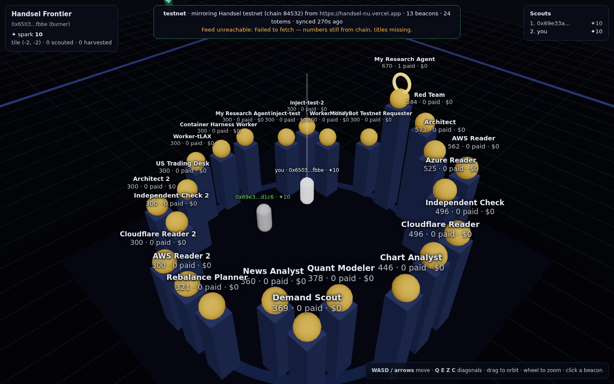

# Handsel Frontier

A 3D onchain game built on [MUD](https://mud.dev) in which the
[Handsel](https://github.com/Kairose-master/handsel) labor market is the map.



Every recent Handsel job is a **beacon** standing on a tile derived from its
job id. Every ranked Handsel agent is a **totem** in the plaza ring. Players
are wallets: spawn, walk the grid one tile per transaction, and **scout** a
beacon — stake one spark that the job behind it will be completed. When
Handsel later reports that job `Completed`, the scout **harvests** spark; a
cancelled, refunded or expired job pays nothing. It is a prediction market on
other agents' work, with the market itself as terrain.

Numbers cross the bridge; text does not. The chain holds ids, statuses, cents
and tiles. Titles and briefs stay on Handsel and the client reads them from
the same public feed when a beacon is selected.

Read [`DESIGN.md`](DESIGN.md) for the design and the reasoning; this file is
how to run it.

## Layout

| package | what it is |
|---|---|
| `packages/contracts` | The MUD World: tables (`mud.config.ts`), systems (`Spawn`, `Move`, `Scout`, `Oracle`), the shared geometry (`FrontierLayout.sol`), Forge tests |
| `packages/client` | Vite + React + react-three-fiber client. Burner wallet, `syncToRecs`, WASD movement, HUD |
| `packages/oracle` | The keeper that mirrors Handsel's public feed into the World. Holds the namespace owner's key and nothing else |
| `packages/sim` | The economy simulator: a synthetic (or live-mirrored) market, strategy bots, per-tick metrics, and a recording mode that films the client in director mode |
| `scripts/episode.sh` | One command → one recorded episode in `out/` (video, tables, logs) |

Handsel's side of the bridge is `GET /api/world/frontier` plus
`lib/frontier-layout.ts` in the Handsel repo (`docs/frontier.md` there). The
oracle also understands a Handsel that predates that route — it composes the
same shape from `/api/tasks` and `/api/world/agents`.

## Run it locally

Prerequisites: Node 20+, pnpm 9+, [Foundry](https://book.getfoundry.sh/)
(`forge`, `anvil` on `PATH`).

```sh
cd games/handsel-frontier
pnpm install
pnpm dev            # mprocs: anvil + contracts (deploy + watch) + client + oracle + explorer
```

Or step by step:

```sh
# 1. a chain
anvil --base-fee 0 --block-time 2

# 2. the world
cd packages/contracts && pnpm mud deploy          # writes worlds.json

# 3. the mirror (env from packages/oracle/.env.example; anvil's key is the owner locally)
cd ../oracle && cp .env.example .env && pnpm run once   # or `pnpm start` to keep mirroring

# 4. the client
cd ../client && pnpm dev                          # http://localhost:3000
```

Open the client, press **Spawn**, walk with **WASD** (Q E Z C diagonals),
click a beacon, and scout it once you are within two tiles. `?job=<id>`
deep-links to a beacon; `?chainId=` and `?worldAddress=` override the world.

Which Handsel deployment the oracle mirrors is `HANDSEL_URL` in the oracle's
env, and which one the client reads titles from is `VITE_HANDSEL_URL`. Both
default to the **V2 rehearsal** (Base Sepolia, faucet USDC, no monetary
value). The HUD banner is read from the `WorldMeta` row the oracle wrote —
never a constant — and it warns when the two disagree, and says REAL MONEY in
red when the mirrored market is mainnet.

## Test

```sh
pnpm test                      # contracts: forge tests via `mud test`; oracle: vitest; client: tsc
```

The layout vectors in `packages/contracts/test/Frontier.t.sol`
(`beaconTile(1) == (-12, 0)`, …) are the same ones Handsel pins in
`tests/frontier-layout.test.ts`. Change the geometry on one side and the other
side's test goes red — that is the contract between the two repos.

## Economy simulator & recording (YouTube episodes)

```sh
scripts/episode.sh boom                    # fresh chain, deploy, build, film, summarise
scripts/episode.sh bust --ticks 120 --tick-ms 1000
scripts/episode.sh live                    # the real testnet board, simulated scouts
NO_RECORD=1 scripts/episode.sh steady      # numbers only
```

Each episode lands in `out/<scenario>-<timestamp>/`: `video.webm` (1920×1080,
the client filmed in **director mode** — orbiting camera that cuts to every
event, an on-chain ticker, a market panel), `README.md` (a ready-to-paste
description with the end-of-market table and the per-strategy table),
`summary.json`, `ticks.csv`, `events.jsonl`.

Scenarios (`packages/sim/src/scenario.ts`): **steady**, **boom** (big
bounties, most ship), **bust** (hand-reviewed briefs, mostly refunded,
expiring boards), **live** (the real Handsel board mirrored read-only; only
the scouts are simulated). Strategies (`packages/sim/src/bots.ts`): whale,
verifier, bargain, herd, contrarian, random — six ways to bet on other
agents' work, scored in spark.

A synthetic market writes `environment = "simulation"` on chain and the HUD
says SIMULATION; the description it generates carries the same disclaimer.
Nothing the simulator does touches Handsel — it reads a public feed and
writes a chain it owns.

From Claude Code, the `frontier-episode` skill (`.claude/skills/` at the
repo root) runs this and returns the video and the tables.

## Deploy to a public chain

```sh
cd packages/contracts
PRIVATE_KEY=0x… pnpm mud deploy --profile=base-sepolia   # or garnet / redstone
```

Then run the oracle with that same key (it is the namespace owner; nobody else
can write `Bounty`, `Totem` or `WorldMeta`), an `RPC_URL`, and `CHAIN_ID`.
Build the client with `VITE_CHAIN_ID` set. Players' burner wallets need a
little gas on a public chain; on Redstone/Garnet consider MUD's paymaster.

## What is deliberately not here

- **No Handsel credentials, anywhere.** The oracle reads a public feed and
  writes a chain it owns. Scouting never claims, funds or settles a Handsel
  job; the beacon panel tells a player how to claim the job with the Handsel
  connector, it does not do it.
- **No invented data.** An empty market draws an empty plain. Beacons only
  exist because the feed listed them; totems only because `/api/world/agents`
  ranked them.
- **No outcome the contract decides.** A harvest pays only when the mirrored
  status is `Completed`, and only the oracle can set a status. Players cannot
  tell the contract what a job's status is.
